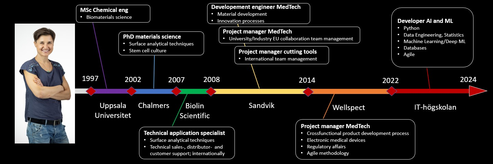

# Dorota Bjöörn MSc, PhD:

Welcome to my student repo at IT-högskolan were I study to become AI and Machine Learning developer (Aug 2022-May 2024)

I am an expereinced Project Manager mainly from product development within medical technology and also cutting tool development. The main focus in my role is allways creating a well functioning team and an environment enabling my team members to perform at their best. I am good at listening, creating clear structures, motivating and communication. I am result- and solution oriented. I am also curious and always interested in learning new things, which has now led me to study again. A am very excited about this new step where I hope to soon pursue my career in a dynamic company with a strong innovative culture and clear team sprit, where I can make a difference.
  

### For more about my education and work expereince see
- [LinkedIn][linkedin]
- CV - link to be added

[linkedin]: https://www.linkedin.com/in/dorota-bj%C3%B6%C3%B6rn-95454a50/

  

---

## GitHub portfolio :briefcase:

| Repo                           | Description                        | Note    |
| ------------------------------ | ---------------------------------- |---------------------|
| [Deep learning][dl]            | deep learning course               | repo to be created April 2023
| [Machine learning][ml]         | traditional machine learning       | repo to be created February 2023
| [Data analysis - lab][da_lab] | data analysis in Pandas, visualisation with Seaborn and Plotly Express  | my own work
| [Data analysis - project][da_dash]| data analysis in Pandas, results in dashboard | group effort, my contribiution all data analysis and call-backs code
| [Statistics - lab][stats]      |statistical analysis of Iris dataset mainly with Scipy and Statmodels | my own work          |
| [Python - labs][python-labs]  | first ML algorithm and first OOP program | my own work|
|                                |

[dl]: https:
[ml]: https:
[da_lab]: https://github.com/DorotaBjoorn/Databehandling-Dorota-Bjoorn/tree/main/Lab
[da_dash]: https
[stats]: https://github.com/DorotaBjoorn/Statistics-Dorota-Bjoorn/tree/main/Project
[python-labs]: https://github.com/DorotaBjoorn/Python-Dorota-Bjoorn/tree/main/Labs

 

---
---

## Contact me :iphone:

- [: LinkedIn][linkedin]

[linkedin]: https://www.linkedin.com/in/dorota-bj%C3%B6%C3%B6rn-95454a50/
