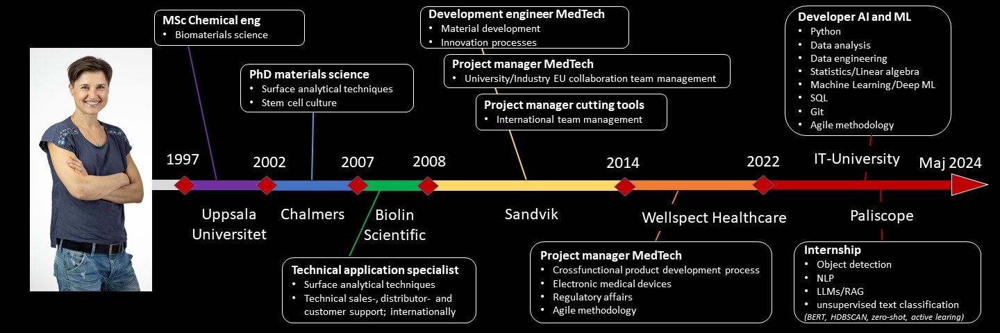

# Dorota Bjöörn MSc, PhD:

Welcome to my student repo at IT-högskolan were I study to become AI and Machine Learning developer (Aug 2022-May 2024)

I am an experienced project manager with a background primarly in product development within medical technology and cutting tools. The main focus in my roles has been to create an environment which enables my team members to perform at their best. I am good at listening, creating clear structures, motivating others and communication. I am result- and solution oriented and put my efforts where I can craete value. I am also curious and always interested in expanding my knowledge, which has led me to study AI and machine learning. I am very excited about this new step and I hope to pursue my career at a dynamic company with a strong innovative culture and clear team sprit, where I can make a difference.​
  

#### For more about my education and work experience see:
- [LinkedIn][linkedin]
- [CV][CV]

[linkedin]: https://www.linkedin.com/in/dorota-bjoorn/
[CV]: assets/CV_one_pager.pdf

  

---

## GitHub portfolio :briefcase:

| Repo                              | Description                                      | Note    |
| ------------------------------    | ----------------------------------               |---------------------|
| [Deep machine learning][dml]      |deep machine learning                             | repo to be created November 2023
| [Data engineering][de]            |data egnineering                                  | repo to be created May 2023|
| [Databases][db]                   | SQL                                              | repo for ongoing course|
| [Machine learning - lab][ml]      |machine learning models explored (scikit-learn)                    | my own work|
| [Data analysis - lab][da_lab]     | data analysis (Pandas, Seaborn, Plotly)  | my own work
| [Data analysis - project][da_dash]| data analysis, results in dashboard | group effort, my contribution all data analysis and call-backs code
| [Statistics - lab][stats]         |statistical analysis and report (Scipy, Statmodels) | my own work          |
| [Python - labs][python-labs]      |ML algorithm, OOP (NumPy, Matplotlib) | my own work|
|                                   |                                                   |

[dml]: https:
[de]: https:
[db]: https://github.com/DorotaBjoorn/Databases-Dorota-Bjoorn
[ml]: https://github.com/DorotaBjoorn/Machine-Learning-Dorota-Bjoorn/tree/main/lab
[da_lab]: https://github.com/DorotaBjoorn/Databehandling-Dorota-Bjoorn/tree/main/Lab
[da_dash]: https://github.com/DorotaBjoorn/Databehadling-projekt
[stats]: https://github.com/DorotaBjoorn/Statistics-Dorota-Bjoorn/tree/main/Project
[python-labs]: https://github.com/DorotaBjoorn/Python-Dorota-Bjoorn/tree/main/Labs

 

---
---
 

## Contact me :iphone:

[LinkedIn]

[LinkedIn]: https://www.linkedin.com/in/dorota-bjoorn/
