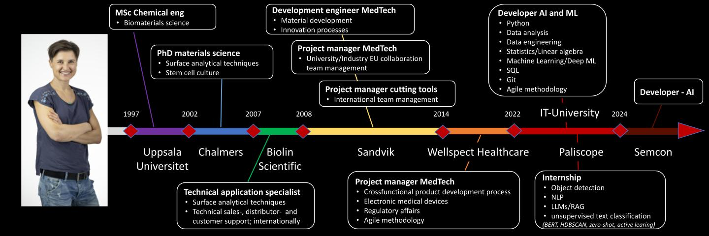

# Dorota Dahlborg MSc, PhD:

Welcome to my student repo at IT-University (ITHS) where I studied AI and Machine Learning (Aug 2022-May 2024).

I am an engineer and experienced project manager with a background in product development within medical technology and cutting tools. My main focus has always been to create an environment, which enables my team members to perform at their best. I am good at creating clear structures, motivating others and communication. I am result- and solution oriented and put my efforts where I can create most value. I am also curious and always interested in expanding my knowledge, which has led me to study AI and machine learning. I am very excited about this new step and eager to transition my career into the tech industry, where I want to make a real difference.
  
My studies of AI and ML at IT-University were a good complement to my theoretical background as an engineer and were very hands-on, which suited me well. From my studies I have experience with cleaning and preparing both image and text data with for example Pandas, Spacy, NLTK; building and evaluating models in frameworks such as TensorFlow/Keras, PyTorch, scikit-learn for ML and Deep ML (from scratch or with transfer learning). I have also experience in Data Engineering: ELT/ETL, CI/CD with GitHub Actions, Docker and pipelines in Airflow. During my internships I focused mainly on text data, for example analysis of domain-specific, non-annotated text, working with concepts such as BERT-models, unsupervised clustering and labeling techniques, zero-shot classification, and active learning. Futhermore I have extensively explored potential of small LLMs and various strategies to constrain and structure their output. Finally I have finetuned models for custom object detection (Paliscope property). This hands-on experience contributed to the ongoing development, bringing ideas closer to tangible products​.
  

#### For more about my education and work experience see:
- [LinkedIn][linkedin]
- [CV][CV]

[linkedin]: https://www.linkedin.com/in/dorota-dahlborg/
[CV]: assets/CV_Dorota_Dahlborg.pdf

  

---
---

## GitHub portfolio

| Repo                              | Description                                      | Note    |
| ------------------------------    | ----------------------------------               |---------------------|
| [Diploma project][dp]             |exploration of strategies to constrain and structure output from small local LLMs | my own project in collaboration with supervisor|
| [Deep ML - project][dml_proj]      |building GRU model and hyperparameter tuning for text classification (Tensorflow, Scikit-learn ) | my own work|
| [Deep ML - RNN lab][dml_lab2]      |(a) building RNN/GRU/LSTM for text classification (TensorFlow, Scikit-learn), (b) additional work on transfer learning (Huggingface/transformers, KerasNLP)|my own work|
| [Deep ML - CNN lab][dml_lab1]      |(a) building CNN for image classification,  (b) tranfer learning and hyperparemeter tuning (TensorFlow, Scikit-learn)                            | my own work
| [Paliscope - proj2][LIA2]      |active learning of ML models on blog posts                          | short explorative task during internship
| [Paliscope - proj1][LIA1]      |unsupervised text clustering and labeling (NLP, BERT, UMAP, HDBSCAN, TF-IDF)                           | short explorative task during internship
| [Data engineering - proj][de]            |ELT, LLM, docker, airflow, dashboard                                | group effort, my contribution ci/cd, docker, airflow, backend logic in collaboration|
| [Databases - labs][db]                   | SQL queries, build database                      | my own work|
| [Machine learning - lab][ml]      |machine learning models explored (Scikit-learn)   | my own work|
| [Data analysis - lab][da_lab]     | data analysis (Pandas, Seaborn, Plotly)  | my own work
| [Data analysis - project][da_dash]| data analysis, results in dashboard | group effort, my contribution all data analysis and call-backs code
| [Statistics - lab][stats]         |statistical analysis and report (Scipy, Statmodels) | my own work          |
| [Python - labs][python-labs]      |ML algorithm, OOP (NumPy, Matplotlib) | my own work|

[dp]: https://github.com/DorotaBjoorn/LLM-diploma-project
[dml_proj]: https://github.com/DorotaBjoorn/Deep-Machine-Learning-Dorota-Bjoorn/tree/main/project
[dml_lab2]: https://github.com/DorotaBjoorn/Deep-Machine-Learning-Dorota-Bjoorn/tree/main/lab_RNN
[dml_lab1]: https://github.com/DorotaBjoorn/Deep-Machine-Learning-Dorota-Bjoorn/tree/main/lab_CNN
[LIA2]: https://github.com/DorotaBjoorn/Active-Learning-LIA-project
[LIA1]: https://github.com/DorotaBjoorn/Text-Classification-LIA-project
[de]: https://github.com/DorotaBjoorn/Data-Engineering-Project
[db]: https://github.com/DorotaBjoorn/Databases-Dorota-Bjoorn/tree/main/lab
[ml]: https://github.com/DorotaBjoorn/Machine-Learning-Dorota-Bjoorn/tree/main/lab
[da_lab]: https://github.com/DorotaBjoorn/Databehandling-Dorota-Bjoorn/tree/main/Lab
[da_dash]: https://github.com/DorotaBjoorn/Databehadling-projekt
[stats]: https://github.com/DorotaBjoorn/Statistics-Dorota-Bjoorn/tree/main/Project
[python-labs]: https://github.com/DorotaBjoorn/Python-Dorota-Bjoorn/tree/main/Labs

---
---
 

## Contact me

[LinkedIn]

[LinkedIn]: https://www.linkedin.com/in/dorota-dahlborg/
